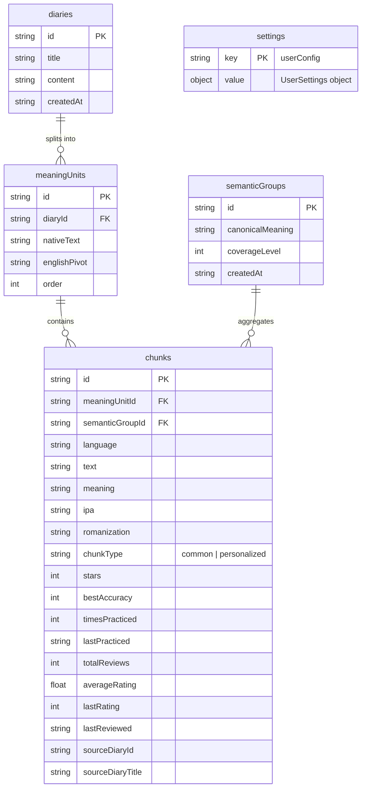

# ChunkDiary - System Architecture

Welcome to the technical architecture documentation for **ChunkDiary**, a modern web application designed for natural language acquisition through chunk-based writing, recording, and pronunciation practice.

---

## 1. System Overview & Tech Stack

ChunkDiary is built as a single-page application (SPA) with a lightweight local Express backend serving development assets and proxying AI requests.

*   **Frontend Framework**: React 19, TypeScript (v5.8), Vite (v6), and TailwindCSS (v4).
*   **Animations & Icons**: Motion (Framer Motion replacement) for page transitions, Lucide React for UI iconography.
*   **Database**: Client-side **IndexedDB** for local-first, privacy-respecting storage (no cloud user accounts required).
*   **Backend Server**: Node.js Express server (`server.ts`) written in TypeScript, compiled with `esbuild`. 
    *   Acts as a dev server with Vite middleware in local environment.
    *   Hosts a sequential AI Proxy `/api/generate-chunks` with multi-model fallback capability.
*   **Speech Services**: Uses standard Web APIs built into modern browsers:
    *   **Speech Recognition**: `webkitSpeechRecognition` / `SpeechRecognition` API.
    *   **Text-to-Speech (TTS)**: `window.speechSynthesis`.

---

## 2. Directory Structure

```
chunk-diary/
├── assets/                  # Public asset files
├── dist/                    # Production bundle outputs
├── public/                  # Static assets (favicons, manifests, etc.)
├── server.ts                # Express backend server (sequentially-handled LLM proxy & dev setup)
├── index.html               # Main SPA Entry Point
├── package.json             # Build configurations & node dependencies
├── vite.config.ts           # Vite compile parameters
└── src/
    ├── App.tsx              # Root React component, router, layout & permissions coordinator
    ├── index.css            # Custom CSS system, themes, and global Tailwind setup
    ├── main.tsx             # Entry point bootstrapping the React virtual DOM
    ├── types.ts             # Domain-specific TypeScript declarations (Diary, Chunk, UserSettings, etc.)
    ├── components/          # Reusable React components & views
    │   ├── HomeView.tsx           # Dashboard view featuring stats, streaks & quick actions
    │   ├── MyDiaryView.tsx         # List and details of written diaries
    │   ├── MyChunksView.tsx        # Chunk list, filtering, and study library
    │   ├── PracticeGameView.tsx    # Pronunciation game loop
    │   ├── SettingsView.tsx        # User profile, language selections, and API key management
    │   ├── MicPermissionModal.tsx  # Modal handling microphone access issues
    │   ├── profile/
    │   │   └── UserProfileSetup.tsx # Onboarding form for first-time setup
    │   └── story_chat/             # Self-contained voice-first guided conversational wizard
    │       ├── components/         # Sub-components (DraftReview, Header, SummaryView, VoiceInput, etc.)
    │       ├── db/                 # Local persistence for chat sessions (storySessionDb.ts)
    │       ├── hooks/              # Reusable hooks (useIdleTimer, useVoiceRecorder)
    │       ├── models/             # Local types (types.ts)
    │       ├── servises/           # Story lifecycle service layers (storyService.ts)
    │       └── workflow/           # State machine logic & chatbot prompt templates (chatbotWorkflow.ts)
    ├── db/                  # Core client-side database logic
    │   ├── indexedDb.ts            # IndexedDB manager, store definitions, CRUD actions
    │   └── userDb.ts               # Sub-helpers for user settings persistence
    └── utils/               # Shared utilities
        ├── aiService.ts            # Google Apps Script primary LLM connector
        ├── browser.ts              # Browser runtime detection helpers
        ├── speech.ts               # Pronunciation scoring and speech recognition setup
        └── tts.ts                  # SpeechSynthesis (text-to-speech) wrappers
```

---

## 3. Database Schema (IndexedDB)

The database utilizes client-side **IndexedDB** with five primary object stores:



*   **`diaries`**: Stores user-written stories or diary entries.
*   **`meaningUnits`**: Stores sentences/ideas extracted from diaries. Acts as the intermediate link.
*   **`chunks`**: Extracted linguistic chunks (collocations, words, phrases) mapping to a specific meaning unit, complete with review history, stars, and pronunciation scores.
*   **`semanticGroups`**: Classifies related chunks across different diaries into canonical meanings to build a personal semantic vocabulary library.
*   **`settings`**: Key-value pair configuration for user onboarding data, preferred native and target languages, CEFR level, target hobbies/professions, and API keys.

---

## 4. AI & Chunk Generation Pipelines

To process a diary, the application splits the narrative into sentences, translates them, and extracts phonetic chunks. It supports two pipelines:

### Pipeline A: Cloud-Based Apps Script Endpoint (Primary)
By default, `src/utils/aiService.ts` makes a request to a designated **Google Apps Script web app endpoint**.
*   **Input**: The diary content, native language, target languages, CEFR level, profile context, and existing semantic groups.
*   **Action**: Apps Script coordinates language translation, chunks parsing, IPA retrieval, and returns an unified response.

### Pipeline B: Local Sequentially-Handled LLM Proxy (Fallback & Custom Keys)
If the primary endpoint is unavailable, or if the user configures custom keys, the request goes to the `/api/generate-chunks` endpoint on the Express server (`server.ts`).
*   **Multi-Model Sequential Fallback**: The server tries models in a configured fallback order (e.g. Gemini `gemini-3.5-flash` -> `gemini-3.1-flash-lite`, or OpenAI, or xAI depending on settings).
*   **Schema Enforcement**: Responses are validated against strict JSON schemas configured via `@google/genai` or standard OpenAI structural APIs.

---

## 5. Pronunciation Evaluation Engine

The evaluation module (`src/utils/speech.ts`) compares the spoken text recognized by the Web Speech API with the target chunk text. It uses different heuristics based on language characteristics:

1.  **Space-Separated Languages (English, French, Spanish, Vietnamese, etc.)**:
    *   Splits sentences into words.
    *   Calculates similarity using **Levenshtein Distance** for each word.
    *   Matches spoken words with target words, marking each as `"good"` ($\ge 80\%$), `"improve"` ($50\% - 79\%$), or `"wrong"` ($< 50\%$).
2.  **Logographic/Character-Based Languages (Chinese, Japanese)**:
    *   Splits sentences into characters.
    *   Performs character-by-character validation to account for missing space separators.
3.  **Accuracy-to-Star Mapping**:
    *   Calculates a weighted average between individual word scores ($70\%$) and overall string similarity ($30\%$) to penalize skipped words.
    *   Maps score to stars: **5 Stars** ($\ge 95\%$), **4 Stars** ($80\% - 94\%$), **3 Stars** ($60\% - 79\%$), **2 Stars** ($40\% - 59\%$), and **1 Star** ($< 40\%$).

---

## 6. Story Chat Module (`src/components/story_chat`)

The **Story Chat** module replaces traditional diary writing with a voice-guided workflow. 

### Core Design Philosophy
*   **Zero LLM Conversational Cost**: The chatbot (named *Sky*) is **completely offline and non-generative**. It uses predefined prompts and scripts instead of an interactive LLM to guide users. This keeps cost at zero and ensures predictable conversational flow.
*   **Strict Voice-First Validation**: It promotes speech by providing recording interfaces, enforcing a draft-review phase (where speech recognition outputs are displayed for modification or deletion *before* sending), and running idle timeout timers (reminds user at 30 seconds, prompts pause/stop at 60 seconds).
*   **Separation of Concerns**: The module is strictly sandboxed in its subdirectory, calling only shared utility services like IndexedDB, TTS, and the AI Service when completing a story.

### Workflow Diagram

```
[Start Session]
       │
       ▼
[Greet User (Offline Script)]
       │
       ▼
[Wait for User Speech / Text Input]
  ├── (Idle 30s) ──► Show Gentle Reminder
  └── (Idle 60s) ──► Prompt Session Pause
       │
       ▼
[Draft Review (Voice Mode Only)]
  ├── Edit ──────► Keyboard Mode
  ├── Delete ────► Reset back to Voice Mode
  └── Send ──────► Append to Conversation Timeline
       │
       ▼
[Complete Story Command] (User triggers "Tạo chunks" / click button)
       │
       ▼
[Summary View] (User can delete/edit sentence order, but cannot add/reorder)
       │
       ▼
[AI Chunk Extraction] ──► Parse & write to IndexedDB ──► [Go to Chunks Library]
```
